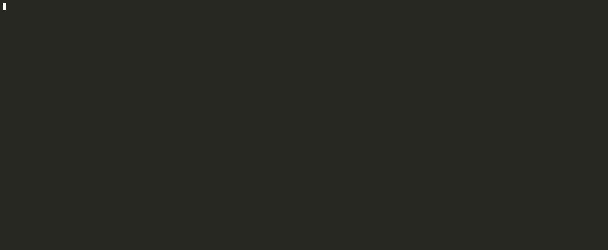
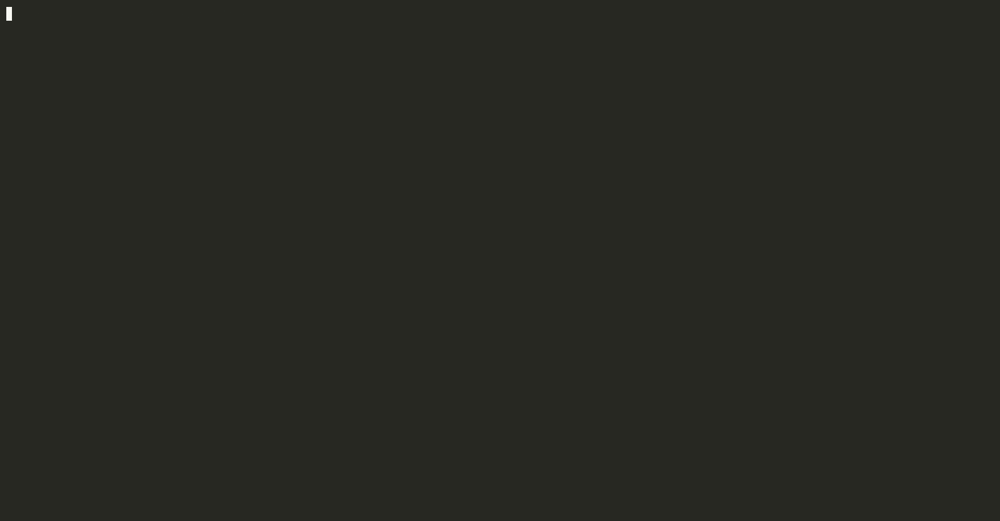

# TermiVerse

## Chat Demo



## System Demo (except chat)



## Architecture

TermiVerse is a shell-like environment where a central **Launcher** manages multiple
application processes. The launcher (`launcher/launcher.c`) reads user commands,
forks child processes from the `bin/` directory, and handles foreground/background
job control via POSIX signals. Each application is a standalone binary.

| Module | Description |
|---|---|
| **Launcher** | Custom shell with job control (fg/bg/jobs), POSIX signal handling, and a command parser supporting quoted arguments and background execution |
| **Chat System** | Multi-client chat over Named Pipes (FIFOs). `chat_server` runs one thread per connected client; `chat_client` spawns a sender thread for concurrent input/output |
| **Alarm** | Countdown timer that writes a message file and sends SIGUSR1 to the launcher process when time expires |
| **Calculator** | Evaluates a simple arithmetic expression passed as arguments and prints the result |
| **Notes** | Persistent plaintext note storage backed by `termiverse_notes.txt`, with flock-based file locking for safe concurrent access |
| **Tetris** | Terminal Tetris with ghost piece, line scoring, and audio via libao |
| **Snake** | Terminal Snake rendered with ncurses |

## About the creators

This project was made by the collectively by the students of Dhirubhai Ambani University (formerly DA-IICT):

1. Darshan Talati (Student ID: 202401046)
2. Dharmesh Upadhyay (Student ID: 202401049)
3. Aarohi Mehta (Student ID: 202401002)
4. Alvita Thakor (Student ID: 202401012)

Project primarily developed during the Computer Systems Programming Course, apart from a few bug fixes and minor improvements in the overall experience and logic of the _TermiVerse_ project.

## Tech Stack

| Technology | Usage |
|---|---|
| C | Launcher, Chat Server/Client, Alarm, Calculator, Notes |
| C++ | Tetris, Snake |
| POSIX Threads (pthreads) | Per-client threads in chat server; sender thread in chat client |
| Named Pipes (FIFOs) | IPC channel between chat server and each client |
| Unix Signals | Job control (SIGCHLD, SIGTSTP), alarm notification (SIGUSR1) |
| flock | File locking in the Notes app |
| termios | Raw terminal mode for Tetris and Snake |
| Makefile | Per-module and root-level build system |

## Build & Run

```sh
make
./bin/launcher
```

**Windows users:** TermiVerse requires a Linux environment and will not run natively
on Windows. Use WSL2 (Windows Subsystem for Linux 2) — open a WSL2 terminal, navigate
to the project directory (e.g. `cd /mnt/c/Darshan/TermiVerse`), and run the commands
above. WSL2 provides a full Linux kernel, so no code changes are necessary.

## Features / Commands

### Applications

| Command | Description |
|---|---|
| `chat <name>` | Join the global chat room |
| `calc <num> <op> <num>` | Calculator (e.g. `calc 10 + 5`) |
| `launch alarm <sec> <msg>` | Set a countdown timer (e.g. `launch alarm 5 "Run"`) |
| `launch turtlesim live` | Play the live trading simulation game against a Bot |
| `launch turtlesim backtest <Asset>` | Run the backtester on data (e.g., `launch turtlesim backtest GOLD`) |
| `launch notes <cmd>` | Notes app — subcommands: `add "text"`, `read`, `clear` |
| `launch snake` | Snake game |
| `launch tetris` | Tetris game |

### System Commands

| Command | Description |
|---|---|
| `jobs` | List all background jobs |
| `fg %<id>` | Resume a stopped or background job in the foreground |
| `bg %<id>` | Resume a stopped job in the background |
| `help` | Show the application menu |
| `quit` | Shutdown TermiVerse |

### Chat Commands

While connected via `chat <name>`:

| Command | Description |
|---|---|
| `/dm <user> <msg>` | Send a direct message to a connected user |
| `/list` | Show all currently connected users |
| `/history` | Display the last 20 public messages |
| `/quit` | Disconnect and exit the chat |
